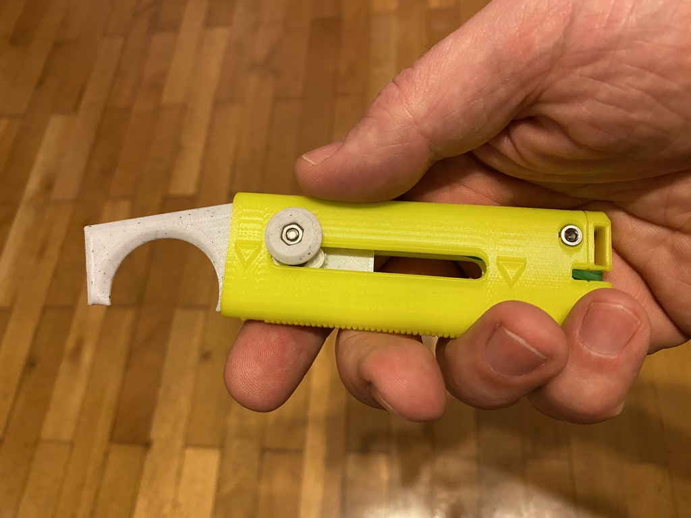
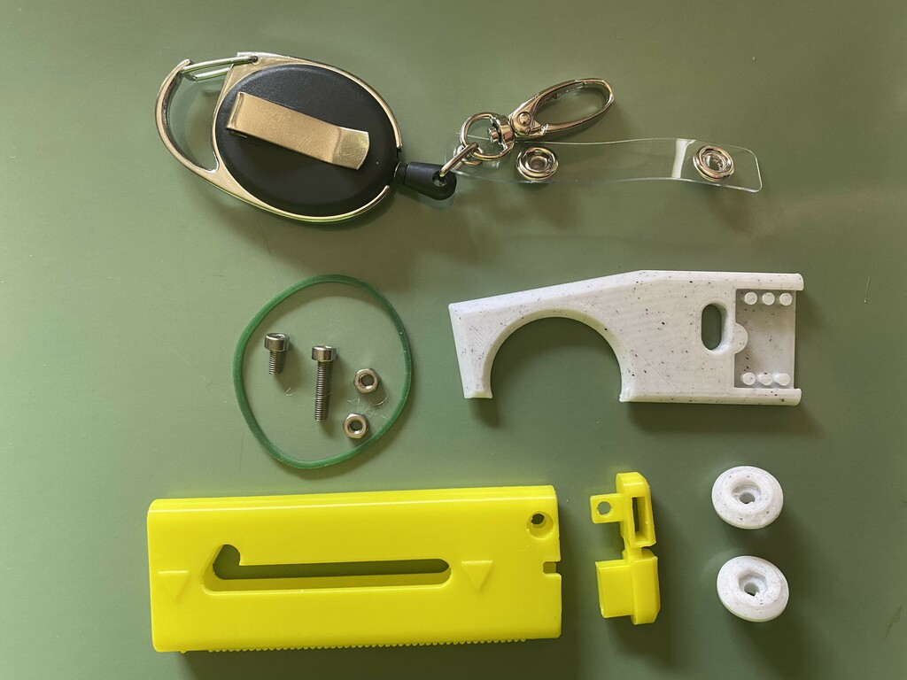
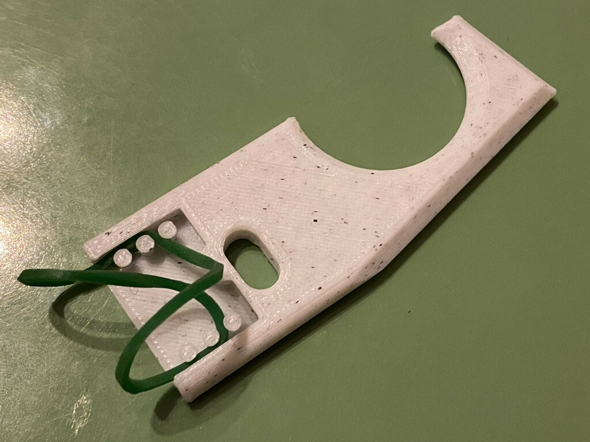
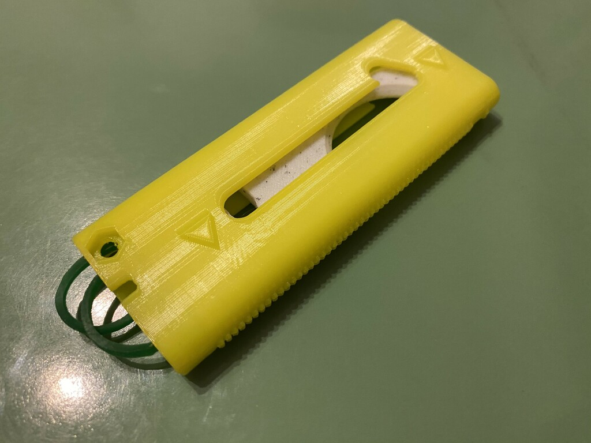
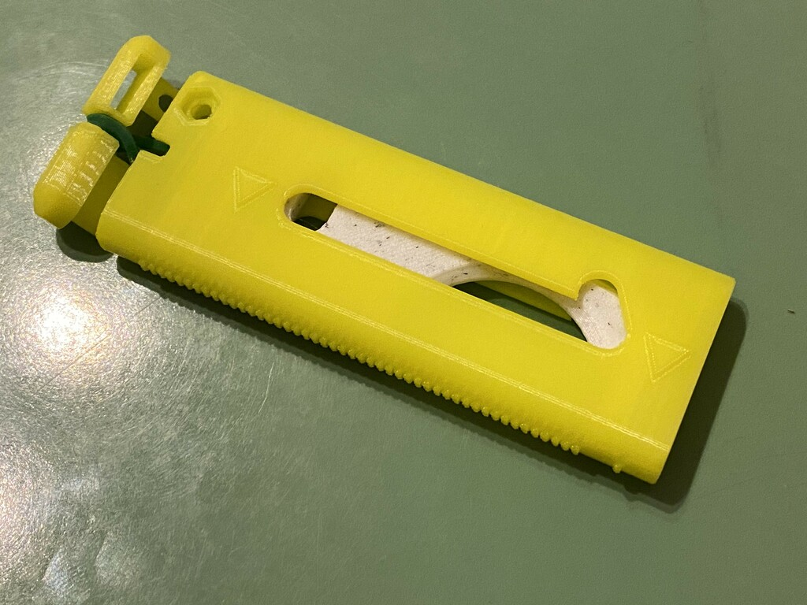
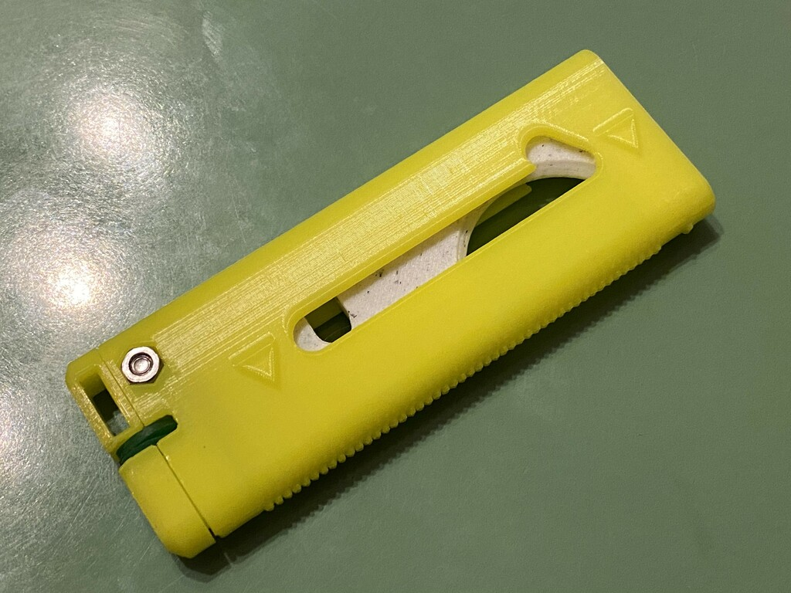
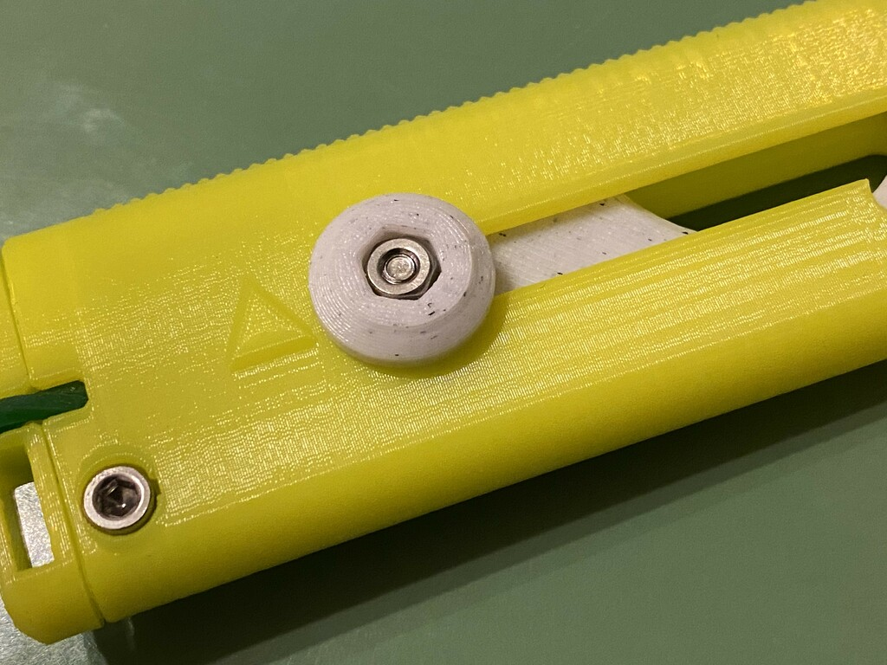
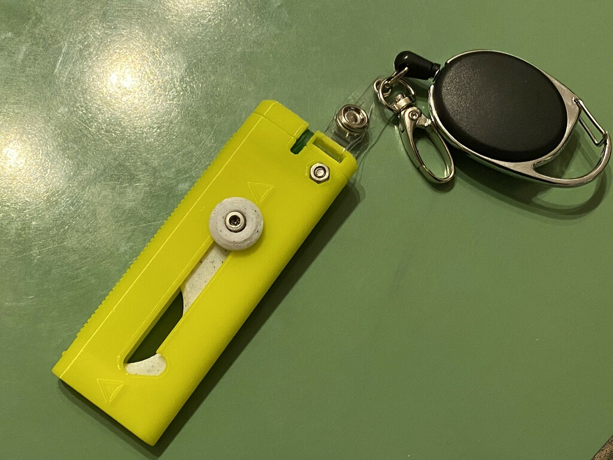

touchlesstool
=============

A customizable, parametric 3D design for a \"truly touchless\" no-touch
tool, designed to allow opening doors, pushing buttons etc. without
coming into direct physical contact with the surfaces. The tool is
\"truly touchless\" in the sense that the tool itself, which potentially
could be contaminated with material from the surfaces it touches, is
normally hidden in a sleeve and protected from accidental touches by the
user.

The model is almost totally parametric, so you can change everything -
make it taller or wider, change some functionality, use different means
of attachment, generate different quality - by changing variables in the
SCAD file.

STLs for printing can be found in the `stl` subdirectory, on Thingiverse
(<https://www.thingiverse.com/thing:4266457>) and on PrusaPrinters
(<https://www.prusaprinters.org/prints/28714-truly-touchless-parametric-no-touch-tool>).

Usage, printing and assembly
============================

Usage
-----

Use the tool to open doors, push buttons or pick-up objects without
touching them with your hand. Extend the tool by pushing the knob with
your fingers. You can lock the tool in its extended state by moving the
knob sideways into the diagonal slot.

In daily use, you can attch the tool to your pants, belt or pocket using
a lanyard or an extensible \"badge yo-yo\". The end cap has a slot for
attaching it.

The tool should offer the user some protection against accidental touch
infection by means of its design. However, users may want to disinfect
it. For disinfection, the tool blade can be rinsed in alcohol or any
sterilizing liquid, or wiped off with a suitable substance, depending on
your context. If you want to be able to sterilize the tool, make sure to
print it with a material that quite literally can take the heat. Common
materials like PLA and PETG are not heat-resistant enough.

Printing
--------

The model is quite print-friendly in the default configuration. There
are no great overhangs or structures that require support - the longest
is a 10mm slot in the endcap. The tool sleeve should be printed
standing, so it may require some adhesion structures (like a brim or
raft). I usually print the sleeve on a raft, and the other structures
\"as is\".

Recommended print settings are: layer height 0.2, infill 25-30%, infill
pattern \"cuboid\" (in Cura) or something similar that gives rigidity in
all directions, and whatever temperature and flow settings match your
filament.

Assembly of printed parts
-------------------------

In the default configuration, assembly requires the following parts:

1.  Printed parts
    1.  Printed tool body (with the hook and central bolt hole)
    2.  Printed sleeve (with the central slot)
    3.  Printed endcap
    4.  Printed bolt
2.  Other parts (\"vitamins\" in RepRap parlance)
    1.  Two bolts M3x6 and M3x14 (or minimally longer).
    2.  Two hex nuts.
    3.  A rubber band (short-ish is better).
3.  Optional parts
    1.  A lanyard or \"badge yo-yo\" for attaching the tool to your belt
        or pocket.

These are the steps for assembly:

Thread the rubber band into the body on both sides. The body has a
cavity at the bottom with rows of posts that are meant for this purpose.
Find a configuration where your rubber band extends in at least one loop
below the body for 1-2 cm (not longer).

Thread the body and rubber band into the sleeve from the top. The sleeve
has raised triangles above and below the slots; this is the direction
where the tip of the tool should point. Then pull the loop end of the
rubber through the bottom of the sleeve. Use a paperclip or similar if
it gets fiddly, which it probably will.

Put the end cap into the rubber loop so that the rubber strands run in
the groove around the endcap, and attach the endcap to the sleeve. It
should sit snugly, and the rubber should not be too loose. Screw the
endcap into the body using an M3x6 bolt and a hex nut.

Insert an M3x14 bolt and hex nut into the two parts of the printed
central bolt, and attach them through the central hole.

(optional) Thread your lanyard through the slot in the endcap.

That\'s it!

Customization
=============

The model was written in SCAD and is parametric and highly customizable.
It is designed with 3D printing in mind. Open it in
[OpenSCAD](https://www.openscad.org) to see the configuration options
and generate STL files for printing.

Common customization use cases
------------------------------

In the default configuration, the model generates an STL file with all
the parts for a tool that is about 9.5 by 3.5 by 1 cm, held together by
M3 bolts.

### Generating only some parts, or separate parts

This is a FAQ item. In the SCAD file, there are a set of configuration
items in the beginning that allow you to specify which parts of the
model to generate. You can set them to `true` one by one to generate
STLs for the parts you need.

### A model with no lanyard slot, or with a hole for a keyring

Set `ATTACHMENT_STYLE` to `none` or `hole` instead of the default
`slot`. The diameter of the keyring hole is set by `CAP_HOLE_DIA`, the
default is 5mm. If you add a keyring hole, you might also need to
increase `CAP_HEIGHT` and/or lower `CAP_CHAMFER`, to make sure that the
cap is big enough to hold the key ring securely.

### A model that works without bolts

If you prefer to glue the model together, and would like to do without
bolts, change the following:

-   Set `CAP_SCREW` to false. This will remove the screw hole in the
    sleeve and will generate a shape for the endcap that is more
    suitable for glueing.
-   Set `SCREW_DIA`, `SCREW_HEAD_DIA` and `SCREW_NUT_DIA` to zero. This
    will generate a bolt without a screw hole.
-   If you want to glue the bolt together, the best bolt type
    (`BOLT_TYPE` variable) is probably `chicago`. This will generate a
    sleeve bolt with an inner and outer part. Glue the inner into the
    outer bolt for a reasonably strong connection.
-   If you are really worried about the strength of your bolt, you can
    set the `BOLT_TYPE` variable to `halves`. This will split the bolt
    in half and place the halves flat on the print bed. You will have to
    glue them together, but with this placement the layer direction will
    be longitudinal to the bolt, resulting in much better shear
    strength.

### A model that works with an existing Chicago bolt

If you have a metal Chicago bolt (e.g. with 6mm diameter), like in Elwin
Alvarado\'s original model, do the following:

-   Set `BOLT_TYPE` to `knob`, this should generate only the knob with
    no bolt.
-   Set `SCREW_DIA` to the diameter of your bolt.
-   Set `SCREW_HEAD_DIA` and `SCREW_NUT_DIA` to the diameter of your
    bolt\'s head, and `SCREW_HEAD_FACES` and `SCREW_NUT_FACES` to a high
    value (e.g. 50), ssuming that your bolt head is round.
-   Set `SCREW_HEAD_DEPTH` and `SCREW_NUT_DEPTH` to the thickness of
    your bolt\'s head.

If the diameter of your Chicago bolt is not 6 mm, but something else,
set `HOLE_DIA` to the diameter of your bolt.

### A model that works with just an ordinary bolt, instead of a fancy printed one

If you want to use an ordinary bolt (e.g. M3x14 or M3x16) in place of a
printed bolt, set `HOLE_DIA` to the diameter of your bolt with some
reserves - e.g. 3.6 for an M3 bolt - and follow the instructions for the
existing Chicago bolt above. Remember to keep the `SCREW_NUT_FACES`
value to 6 if you want to secure the bolt with an ordinary captive hex
nut.

The advantage of this scenario is that the slot is narrower, so that
there is less possibility to accidentally touch something inside. Note
that this is still quite an elusive scenario. However, this kind of
attachment is not recommended, because the knob will slide along the
body and will be hard to extend, and because the sleeve material will
suffer from repeated snapbacks of the bolt threads moving up and down
the sleeve.

### A model with a longer sleeve, so that the hook is hidden inside when retracted

The rationale behind a longer sleeve is that with the default length,
you can still see the hook through the slot, and there is a small but
nonzero probability that your hands might get in touch with infected
material on the hook that way. If you make the sleeve longer, the
potentially contaminated parts of the hook are above the side slot, so
you can\'t touch them.

In this case, set `BODY_LENGTH` to a higher value - e.g. 120 instead of
80 if you leave the hook size otherwise unchanged.

In addition, set `EDGE_EXTEND` to a higher value, because with the
longer tool, otherwise the diagonal cutoff cuts off more of the back
edge. Instead of the default 0.98, a value such as 1.2 is a good idea.

### A model with a thicker sleeve

Set `SLEEVE_THICKNESS` to a higher value, e.g. 3mm instead of the
default 1.5. You might also need to check the height and chamfer of the
endcap to make sure that it still looks good.

Overview of customization options
---------------------------------

For a detailed overview of customization options, see the source code,
it has documentation built in. You can customize pretty much everything
in terms of dimensions and functionality.

Common questions and to-do list
===============================

FAQ
---

### I need separate STLs for the parts.

Go to the beginning of the SCAD file and set the `GENERATE_BODY`,
`GENERATE_SLEEVE`, `GENERATE_ENDCAP` and `GENERATE_BOLTS` to generate
only those parts that you need.

### Rendering in OpenSCAD is really slow!

That is true. The main culprit here is that most edges in the model are
chamfered. This looks and feels nice in the printed object, but it
generates lots and lots of little polygons around every edge that take
long to render.

Another culprit is the \"roundness\" of the rounded parts - in OpenSCAD
this is the `$fn` setting.

You can remove the chamfering, and stick to the default roundness, by
customizing the model and setting the `CHAMFER` and `ROUND_CIRCLES`
variables in the beginning of the customization section to `false`.

### Compiling the design in OpenSCAD gives an error message about aborting normalization! (Also: I get assertion errors in OpenSCAD!)

Same as above. The model is a bit taxing on OpenSCAD\'s rendering. When
making changes to the model, best set `CHAMFER` and `ROUND_CIRCLES` to
`false` for the time being. That should reduce the complexity enough to
work in a normal OpenSCAD compilation workflow. Then set them back to
`true` when exporting STLs. (In an earlier version of the model, these
variables were called `WORK_IN_PROGRESS`.)

In spite of whatever messages you see during compilation and rendering,
the model should render fine (F6 in OpenSCAD). I tested it using
OpenSCAD 19.01 (in Ubuntu) and 19.05 and it works on both.

To do
-----

-   The tool currently cannot be used well with capacitive touchscreens.
    You could try to print it in a conductive material, or integrate
    some wires into the tip. Older (resistive) touchscreens do work
    somewhat better.

Version history
===============

-   v0.1: Initial design based on SCAD adaptation of Elwin Alavarado\'s
    original idea. Added rubber band fixture v1: vertical slot, ring
    around bolthole
-   v0.2: Added bolt to model; rubber band fixture v2: round hooks on
    front and back (slips too easily)
-   v0.3: Added lanyard slot to endcap; rubber band fixture v3: hooks on
    the left and right (too strong)
-   v0.4: Horizontal locking slot; screw-through bolt design; rubber
    band fixture v4: open space with rubber band posts
-   v0.5: Diagonal locking slot for easier printing; added screw hole to
    endcap
-   v1.0: First published version
-   v1.1: Added keyring hole to endcap, fixed a few bugs

Attribution and license
=======================

The original idea comes from a non-parametric Fusion 360 design by Elwin
Alvarado [published
here](https://www.prusaprinters.org/prints/27210-truly-touchless-no-touching-multi-toolhook)
on PrusaPrinters. Used with permission.

The GitHub repository for this model is
<https://github.com/phrxmd/touchlesstool>.

\(C) 2020 Philipp Reichmuth. Published under the Creative Commons
Attribution-ShareAlike 4.0 International license (see LICENSE.md).
